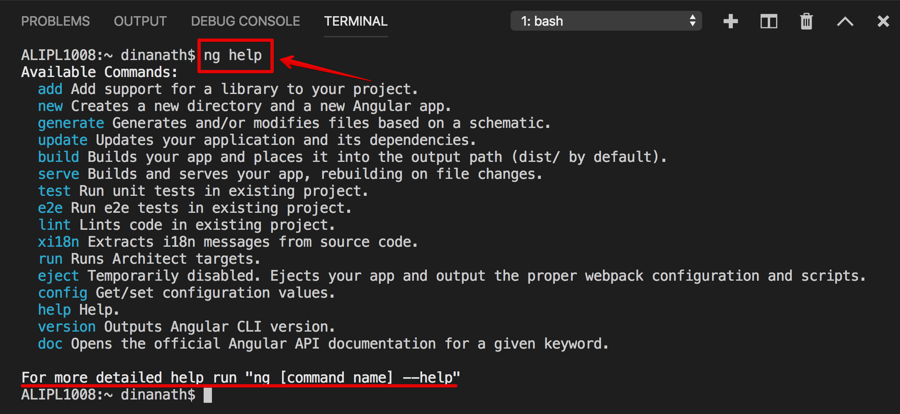
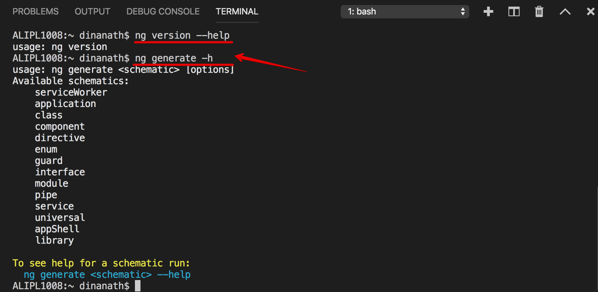
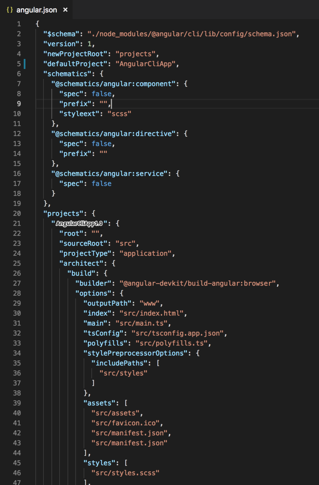

  

Angular CLI
=====================

Welcome
---------------------

About the Course/Tutorial
---------------------
Hi All, I'm **`Dinanath Jayaswal, Senior UI/Web Developer and Adobe Certified Expert Professional`**, I wanna welcome you to `Angular CLI step by step guide from basics to advanced`. This `Angular CLI Tutorial` will help you to understand: 
- How to work with Angular CLI (Angular Command Line Interface)
- How to create Angular Projects/Application scaffold/structure in a short time
- Show a demo on how to create an Angular application, Components, Services, Directives, Routing and Navigation, Pipes, Modules, etc. using Angular CLI
- Helps to learn how to use and master Command Line Interface offered by Angular
- Helps in creating and serving Angular projects on the fly
- How to work and use with different commands of Angular CLI

Who is this for? 
---------------------
This Course/Tutorial is ideal for:
- Freshers and aspiring UI (JavaScript/Angular) developers
- UI Developers/Designers
- Developers upgrading from AngularJS 1.x to Angular 2 or above
- Full Stack Developers
- Technical/Team Leads
- Architects, Technical Project Managers, QAs

This course/Tutorial is for anyone and everyone, Almost everyone! Fresher/Newcomer as well as experienced UI/frontend/Web Developers who are interested in boost skills and further career in Angular world - by learning new latest dynamic tools/utilities which helps to scaffold Angular application to become a hi-tech developer.

Why learn Angular and Angular CLI?
---------------------
**Angular** - Angular is one of the most widely used JavaScript framework used to create scalable, enterprise, and performant client-side web applications. It provides an ecosystem for the development of client-side web applications. The ecosystem for development may include external tools or libraries as well. The ecosystem process includes project bootstrapping, development operations/tools, testing, and build support. One of the best features of Angular framework is that it is quite flexible when it comes to the usage of external libraries apart from the scalability it provides. With Angular framework adoption being high, performance management of the application is community-driven indirectly driving better job opportunities.

**Angular CLI** - Creating Angular application boilerplate manually is tedious, time-consuming monotonous and laborious. `Angular CLI helps to create required Angular application/project scaffolding chunks accurately with Google standards and in no time with ease`.

Course/Tutorial achievement
---------------------

Course/Tutorial Goal
---------------------
After completing/attending this Course/Tutorial, participants should be able to: 
1. Create and work on a real-time Angular Project with Angular CLI (Angular Project setup with Angular CLI)
2. Create and use many-core building blocks of Angular application like Components, Services, Directives, Routing and Navigation, Pipes, Modules, etc.

Topics included/covered
===================== 
1. [Angular CLI Introduction](#01-angular-cli-introduction)
    - 1.1. [What is Angular CLI](#11-what-is-angular-cli)
    - 1.2. [Why use Angular CLI](#12-why-use-angular-cli)
    - 1.3. [Benefits Advantages of Angular CLI](#13-benefits-advantages-of-angular-cli)
2. [Getting Started with Angular CLI](#02-Getting-Started-with-Angular-CLI)
    - 2.1. [Pre-requisites](#21-pre-requisites)
    - 2.2. [Tools required to install Angular CLI](#22-tools-required-to-install-angular-cli)
    - 2.3. [Steps to Setup the Angular CLI development environment](#23-steps-to-setup-the-angular-cli-development-environment)
3. [Angular CLI Commands and Utilities](#03-angular-cli-commands-and-utilities)
    - 3.1. [Angular CLI Create new project/App - ng new](#31-angular-cli-create-new-project)
    - 3.2. [Angular CLI getting help - ng help](#32-angular-cli-getting-help)
    - 3.3. [Angular CLI configuration file - angular.json](#33-angular-cli-configuration-file)

<!--4. [Demo - Angular Application using Angular CLI](#04-components)
5. [Angular CLI Command List](#04-Angular-CLI-Command-List) -->

01 Angular CLI Introduction
=====================

1.1. What is Angular CLI
--------------------- 
- `Angular CLI = Angular Command Line Interface`, its Command Line utility for Angular (website:  https://cli.angular.io/)
  - Angular CLI is Command Line Interface/Tool for creating, serving and managing Angular projects
  - The quickest and easiest way of creating/starting an Angular app is through the `Angular CLI (Command Line Interface)`
  - It allows/helps the developer to build/generate building blocks of Angular application like `Components, Services, Directives, Routing and Navigation, Pipes, Modules`, etc. with best practices, quicker and easier

**Angular CLI is Angular command line tool helps to:**
- Create Angular applications faster and with great consistency
- Create the boilerplate code for angular features like `Components, Services, Directives, Routing and Navigation, Pipes, Modules`, etc.
- Creates boilerplate code TypeScript features like Classes, Interfaces, enums
- Angular CLI follows angulars best practices and conventions out of the box
- Run Unit and End-to-End(e2e) tests
- Creates optimized builds for deployment to production

1.2. Why use Angular CLI
--------------------- 
Creating Angular application boilerplate manually is tedious, time-consuming, monotonous and laborious task - it trends to many mistakes. CLI helps to create required angular chunk accurately in no time on the fly. No doubt Angular CLI, will greatly help us improve our productivity with best Angular practices.

Angular CLI eases and makes Angular app/project development process faster. 

| **without Angular CLI**                   | **with Angular CLI**                      |
| ------------------------------------------|-------------------------------------------|
| **We have to do the setup manually**:   1. download zip/executable/library files,    2. extract   3. follow specific installation process add and    4. edit framework/library configuration files etc. according to the project and  | Just install/setup Angular CLI globally on the machine, generate/create new project by using Angular CLI commands and get started with app in no time  |

 
1.3. Benefits Advantages of Angular CLI
---------------------

1.3. What Angular CLI does?
---------------------
- Setup up the Angular Development environment
- Provides required configuration files (angular.json or angular-cli.json) for Angular project/program
- Reduces development efforts tremendously (eliminates manual entries in configuration/index or startup files)
- Generates Angular project scaffolding/structure on the fly with proper, standard configuration

02 Getting Started with Angular CLI
=====================

2.1. Pre-requisites
---------------------
- Node 6.9.0 or higher (website: https://nodejs.org/en) 
- NPM 3 or higher (Node Package Manager - comes inbuilt with Node)
- Basic familiarity with Angular must (Angular 2 and above)

2.2. Tools required to install Angular CLI
---------------------
In this section, we will list/understand the different tools/Softwares/utilities required to set up a local development environment of Angular CLI.

- `Node`, (website: https://nodejs.org/en) 
- `NPM`, (Node Package Manager - comes inbuilt with Node)
- `Angular CLI = Command Line Interface`, Angular CLI (Command Line Interface) for angular (website:  https://cli.angular.io/), 
    - it allows the developer to build/generate building blocks of angular application like component, services, routings, modules, etc. with best practices quicker and easier)
- `Text Editor`
    - Visual Studio Code / Visual Studio Code Insiders (website: https://code.visualstudio.com)
    - Sublime Text, 
    - Atom, 
    - Brackets etc.

2.3. Steps to Setup the Angular CLI development environment
---------------------
In this section, we will learn how to set up a local development environment of Angular CLI to start developing Angular apps with Angular CLI.

1. Download and Install latest node (node comes with npm) (website: https://nodejs.org/en)

  <figure>
    &nbsp;&nbsp;&nbsp; 
    <figcaption>&nbsp;&nbsp;&nbsp; Image - Nodejs website - https://nodejs.org/en</figcaption>
  </figure>

2. After installation check installed version of node and npm or verify installation by using command: `node -v` / `node --version` OR `npm -v` / `npm --version`
3. Install Angular CLI (website https://cli.angular.io/) by using command: `npm install -g @angular/cli` OR `npm i -g @angular/cli` (it will install Angular CLI globally (-g))

  <figure>
    &nbsp;&nbsp;&nbsp; 
    <figcaption>&nbsp;&nbsp;&nbsp; Image - Angular CLI website - https://cli.angular.io/</figcaption>
  </figure>

4. After installation check version of angular CLI or verify installation by using command by using the command: `ng -v` OR `ng --version` (the command returns versions of Angular CLI, node/npm as well as operating system installed on your local machine), you can also verify angular CLI installation by command: `ng -h` OR `ng --help`

03 Angular CLI Commands and Utilities
=====================

3.1. Angular CLI Create new project
---------------------
3.1. Angular CLI Create new project/App - `ng new`
---------------------
1. Create a new app/project with angular CLI by using the syntax: `ng new project/appName` 
  example: command: `ng new firstAngularCliApp`
    - Create an Angular application that already works, right out of the box with our best practices!
    - Creates a new Angular project. By default the project is created under the current directory itself
   **'ng new' command do following:**   
    - Creates a new folder with the name `firstAngularCliApp`
    - All the `npm dependencies` are installed in `node_modules` folder
    - All the required `configuration and source files` are created
    - `Unit` and `end-to-end tests` are created
    - `Karma unit test runner` is configured
    - `Protractor end-to-end test framework` is configured
2. Go inside the project/app directory or change directory, command: `cd firstAngularCliApp`
3. Build, compile, serve, check and run Angular App in default browser by using angular CLI command: `ng serve` OR `ng serve -o` OR `ng serve --open`
4. To change default port number, syntax: `ng serve --port PORN NUMBER` 
  example: command: `ng serve --port 4500`
5. Go to the browser and launch/check Angular App by entering the web address: `localhost:4200` OR `localhost:4500`

### Watch/live reload mode
**Angular CLI application runs in `watch/live reload mode`** which simply means when you make any changes in application files and perform save, browser/app refresh and load the latest code automatically.

### Table: Angular CLI new command options

| **Angular CLI new command option**        | **Description**                           |
| ------------------------------------------|-------------------------------------------|
| ng new app-name --dry-run   ng new app-name --dryRun   ng new app-name -d     | Run through without making any changes, `--dry-run` flag shows/lists all files/folders that would have been created/generated when using/running `ng new` **( just a mock/dry run of `ng new` command )**        |
| ng new app-name --skip-install   ng new app-name --skipInstall   ng new app-name -si                             | When true, `does not install dependency packages i.e. node_modules folder` |
| ng new app-name --skip-test   ng new app-name --skipTest   ng new app-name -st   ng new app-name -S          | `does not generate "spec.ts" test files` for the new project |
| ng new app-name --inline-style   ng new app-name --inlineStyle   ng new app-name -is   ng new app-name -s          | When true, `includes styles inline in the component .TS file itsleft` (No seperate .css/scss styles files created). By default, an external styles file is created and referenced in the component .TS file. |
| ng new app-name --inline-template   ng new app-name --inlineTemplate   ng new app-name -it   ng new app-name -t          | When true, `includes template inline in the component .TS itsleft` (No seperate .html template files created). By default, an external template file is created and referenced in the component .TS file. |

- Reference: https://angular.io/cli/new

### Table: Angular CLI commands widely used with Angular app

| **Angular CLI command**                   | **Description**                           |
| ------------------------------------------|-------------------------------------------|
| ng new app-name                           | To create new angular app/project         |
| ng build                                  | To build and create distributable/shareable version |
| ng serve                                  | To run/serve angular app                  |
| ng serve --open OR ng serve -o            | To run/serve angular app in default browser |
| ng lint                                   | To run lint/syntax checker                |   
| ng test                                   | To run unit test                          |    
| ng e2e                                    | To run End-to-End test                    |          

3.2. Angular CLI getting help
---------------------
3.2. Angular CLI getting help - `ng help` OR `ng -h`
---------------------
To get the help of Angular CLI commands use `ng help` OR `ng -h` command, it lists available Angular CLI commands and their short descriptions

  <figure>
    &nbsp;&nbsp;&nbsp; 
    <figcaption>&nbsp;&nbsp;&nbsp; Image - Angular CLI Help</figcaption>
  </figure>

### Table: Angular CLI help commands

| **Angular CLI command**                   | **Description**                           |
| ------------------------------------------|-------------------------------------------|
| ng help OR ng -h                          | To get Angular CLI help                   |
| ng version --help                         | To get command-specific help              |
| ng --help > fileName   ng --help > help.txt OR ng --help > readme.doc             | To paste help content text to an external file, to redirect help command output to desired file |  

<!--| `ng --help | clip`                    | To copy help text/help content to the clipboard and then a user can paste to any desired software/application `NOT SUPPORTED`   | -->

  <figure>
    &nbsp;&nbsp;&nbsp; 
    <figcaption>&nbsp;&nbsp;&nbsp; Image - Angular CLI - Command specific Help</figcaption>
  </figure>

- Reference: https://angular.io/cli/help

3.3. Angular CLI configuration file
---------------------
In this section, we will discuss the significance and importance of the Angular CLI configuration file ( older angular versions `2/4/5 = .angular-cli.json`, in latest angular version `6/7/8 = configuration file named as angular.json` ) 

  <figure>
    &nbsp;&nbsp;&nbsp; 
    <figcaption>&nbsp;&nbsp;&nbsp; Image - Angular CLI - configuration json file - angular.json</figcaption>
  </figure>

### angular.json settings are used when we:
- Generate angular features likes components, pipes, services, using stylesheets, etc.
- Run unit and end-to-end tests
- Build the application etc.

### Table: angular.json settings and their purpose

| Setting                       | Purpose                                   | 
|-------------------------------|-------------------------------------------|
| defaultProject                | Name of the project                       |
| projects: root/sourceRoot        | The root directory of the application, default is `src` |
| projects: outputPath            | The output directory for build results, default is `dist` | 
| projects: assets                | List of application assets that you want to copy when building your project. By default, the `src/assets/` folder and `src/favicon.ico` are copied over | 
| projects: index                  | The name of the start HTML file which is by default `index.html`  |
| projects: main                  | The name of the main entry-point file, which is `main.ts` by default | 
| projects: tsConfig              | The `TypeScript` configuration file | 
| projects: polyfills              | The name of the `polyfills` file. Angular is built on the latest standards of the web platform. Targeting such a wide range of browsers is challenging because not all browsers support all features of modern browsers. This can be compensated by using polyfill scripts that implement missing features in JavaScript |
| projects: styles                | Global styles to be included in the build, default is `styles.css`. We can also use `less` or `scss`. To change to less or scss/sass, use the `"style"` option when generating a new angular project using the `"ng new"` command |

- Reference: https://angular.io/guide/workspace-config
