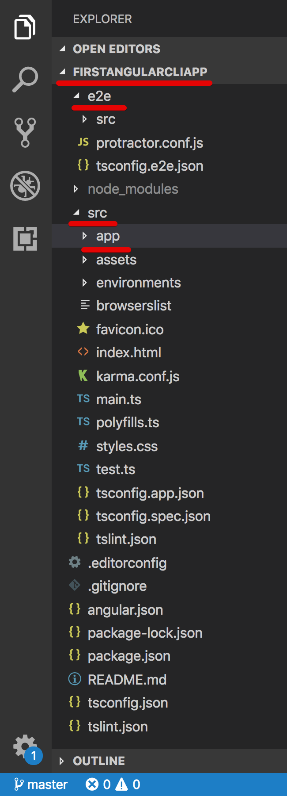
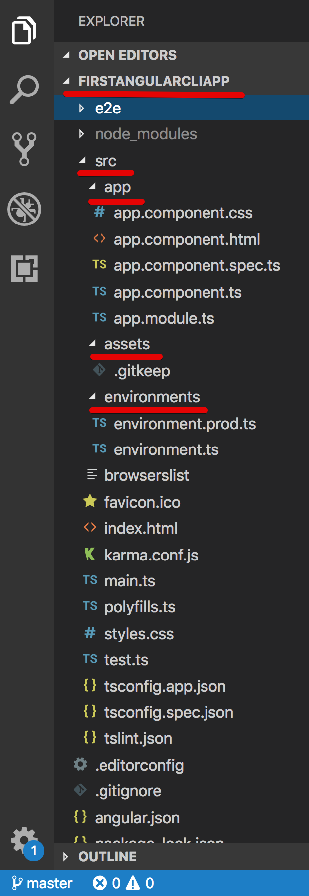
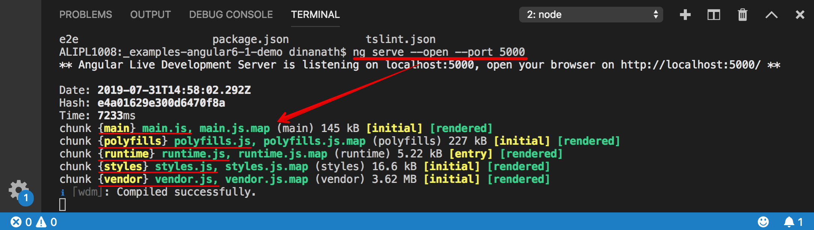
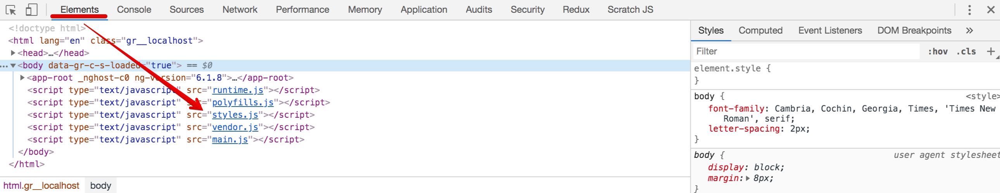
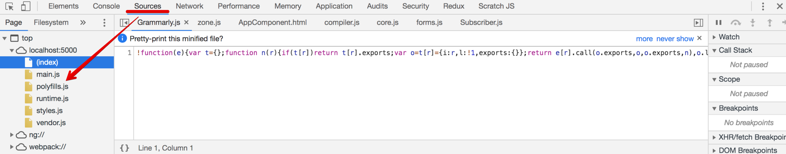
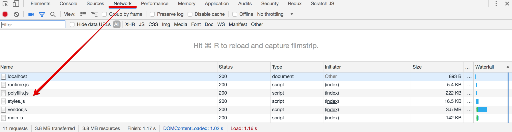

  

Angular CLI
=====================

Welcome
---------------------

About the Course/Tutorial
---------------------
Hi All, I'm **`Dinanath Jayaswal, Senior UI/Web Developer and Adobe Certified Expert Professional`**, I wanna welcome you to `Angular CLI step by step guide from basics to advanced`. This `Angular CLI Tutorial` will help you to understand: 
- How to work with Angular CLI (Angular Command Line Interface)
- How to create Angular Projects/Application scaffold/structure in a short time
- Show a demo on how to create an Angular application, Components, Services, Directives, Routing and Navigation, Pipes, Modules, etc. using Angular CLI
- Helps to learn how to use and master Command Line Interface offered by Angular
- Helps in creating and serving Angular projects on the fly
- How to work and use with different commands of Angular CLI

Who is this for? 
---------------------
This Course/Tutorial is ideal for:
- Freshers and aspiring UI (JavaScript/Angular) developers
- UI Developers/Designers
- Developers upgrading from AngularJS 1.x to Angular 2 or above
- Full Stack Developers
- Technical/Team Leads
- Architects, Technical Project Managers, QAs

This course/Tutorial is for anyone and everyone, Almost everyone! Fresher/Newcomer as well as experienced UI/frontend/Web Developers who are interested in boost skills and further career in Angular world - by learning new latest dynamic tools/utilities which helps to scaffold Angular application to become a hi-tech developer.

Why learn Angular and Angular CLI?
---------------------
**Angular** - Angular is one of the most widely used JavaScript framework used to create scalable, enterprise, and performant client-side web applications. It provides an ecosystem for the development of client-side web applications. The ecosystem for development may include external tools or libraries as well. The ecosystem process includes project bootstrapping, development operations/tools, testing, and build support. One of the best features of Angular framework is that it is quite flexible when it comes to the usage of external libraries apart from the scalability it provides. With Angular framework adoption being high, performance management of the application is community-driven indirectly driving better job opportunities.

**Angular CLI** - Creating Angular application boilerplate manually is tedious, time-consuming monotonous and laborious. `Angular CLI helps to create required Angular application/project scaffolding chunks accurately with Google standards and in no time with ease`.

Course/Tutorial achievement
---------------------

Course/Tutorial Goal
---------------------
After completing/attending this Course/Tutorial, participants should be able to: 
1. Create and work on a real-time Angular Project with Angular CLI (Angular Project setup with Angular CLI)
2. Create and use many-core building blocks of Angular application like Components, Services, Directives, Routing and Navigation, Pipes, Modules, etc.

Topics included/covered
===================== 
01. [Angular CLI Introduction](#01-angular-cli-introduction)
    - 1.1. [What is Angular CLI](#11-what-is-angular-cli)
    - 1.2. [Why use Angular CLI](#12-why-use-angular-cli)
    - 1.3. [Benefits Advantages of Angular CLI](#13-benefits-advantages-of-angular-cli)
02. [Getting Started with Angular CLI](#02-Getting-Started-with-Angular-CLI)
    - 2.1. [Pre-requisites](#21-pre-requisites)
    - 2.2. [Tools required to install Angular CLI](#22-tools-required-to-install-angular-cli)
    - 2.3. [Steps to Setup the Angular CLI development environment](#23-steps-to-setup-the-angular-cli-development-environment)
03. [Angular CLI Commands and Utilities](#03-angular-cli-commands-and-utilities)
    - 3.1. [Angular CLI Create new project/App - ng new](#31-angular-cli-create-new-project)
    - 3.2. [Angular CLI getting help - ng help](#32-angular-cli-getting-help)
    - 3.3. [Angular CLI configuration file - angular.json](#33-angular-cli-configuration-file)
    - 3.4. [Angular CLI project structure](#34-angular-cli-project-structure)
    - 3.5. [Angular CLI generate component](#35-angular-cli-generate-component)
    - 3.6. [Angular CLI generate service](#36-angular-cli-generate-service)
    - 3.7. [Angular CLI generate module](#37-angular-cli-generate-module)
    - 3.8. [Angular CLI generate directives, pipes and routing guards](#38-angular-cli-generate-directives-pipes-and-routing-guards)
    - 3.9. [Angular CLI generate class, interface and enum](#39-angular-cli-generate-class-interface-and-enum)
    - 3.10. [Linting TypeScript](#310-linting-typescript)
    - 3.11. [Angular Routing](#311-angular-routing)
04. [Running angular app locally](#04-running-angular-app-locally)
    - 4.1. [Angular CLI ng serve command options](#41-angular-cli-ng-serve-command-options)
05. [Compile angular app](#05-compile-angular-app)
    - 5.1. [Ng Serve VS Ng Build](#51-ng-serve-vs-ng-build)
    - 5.2. [Dev build VS Prod Production build](#52-dev-build-vs-prod-build)
    - 5.3. [Angular AOT vs JIT](#53-angular-aot-vs-jit)
06. [Angular CLI Command List](#06-angular-cli-command-list)
07. [Angular CLI Resources](#07-angular-cli-resources)

<!-- 4. [Demo - Angular Application using Angular CLI](#04-components) -->

01 Angular CLI Introduction
=====================

1.1. What is Angular CLI
--------------------- 
- `Angular CLI = Angular Command Line Interface`, its Command Line utility for Angular (website: https://cli.angular.io/)
  - Angular CLI is Command Line Interface/Tool for creating, serving and managing Angular projects
  - The quickest and easiest way of creating/starting an Angular app is through the `Angular CLI (Command Line Interface)`
  - It allows/helps the developer to build/generate building blocks of Angular application like `Components, Services, Directives, Routing and Navigation, Pipes, Modules`, etc. with best practices, quicker and easier

**Angular CLI is Angular command line tool helps to:**
- Create Angular applications faster and with great consistency
- Create the boilerplate code for angular features like `Components, Services, Directives, Routing and Navigation, Pipes, Modules`, etc.
- Creates boilerplate code TypeScript features like Classes, Interfaces, enums
- Angular CLI follows angulars best practices and conventions out of the box
- Run Unit and End-to-End(e2e) tests
- Creates optimized builds for deployment to production

1.2. Why use Angular CLI
--------------------- 
Creating Angular application boilerplate manually is tedious, time-consuming, monotonous and laborious task - it trends to many mistakes. CLI helps to create required angular chunk accurately in no time on the fly. No doubt Angular CLI, will greatly help us improve our productivity with best Angular practices.

Angular CLI eases and makes Angular app/project development process faster. 

| **without Angular CLI**                   | **with Angular CLI**                      |
| ------------------------------------------|-------------------------------------------|
| **We have to do the setup manually**:   1. download zip/executable/library files,    2. extract   3. follow specific installation process add and    4. edit framework/library configuration files etc. according to the project and requirements   | Just install/setup Angular CLI globally on the machine, generate/create new project by using Angular CLI commands and get started with app in no time  |

<!-- |                      |  &nbsp;                              | -->

 
1.3. Benefits Advantages of Angular CLI
---------------------

1.3. What Angular CLI does?
---------------------
- Setup up the Angular Development environment
- Provides required configuration files (angular.json or angular-cli.json) for Angular project/program
- Reduces development efforts tremendously (eliminates manual entries in configuration/index or startup files)
- Generates Angular project scaffolding/structure on the fly with proper, standard configuration

02 Getting Started with Angular CLI
=====================

2.1. Pre-requisites
---------------------
- Node 6.9.0 or higher (website: https://nodejs.org/en) 
- NPM 3 or higher (Node Package Manager - comes inbuilt with Node)
- Basic familiarity with Angular must (Angular 2 and above)

2.2. Tools required to install Angular CLI
---------------------
In this section, we will list/understand the different tools/Softwares/utilities required to set up a local development environment of Angular CLI.

- `Node`, (website: https://nodejs.org/en) 
- `NPM`, (Node Package Manager - comes inbuilt with Node)
- `Angular CLI = Command Line Interface`, Angular CLI (Command Line Interface) for angular (website: https://cli.angular.io/), 
    - it allows the developer to build/generate building blocks of angular application like component, services, routings, modules, etc. with best practices quicker and easier)
- `Text Editor`
    - Visual Studio Code / Visual Studio Code Insiders (website: https://code.visualstudio.com)
    - Sublime Text, 
    - Atom, 
    - Brackets etc.

2.3. Steps to Setup the Angular CLI development environment
---------------------
In this section, we will learn how to set up a local development environment of Angular CLI to start developing Angular apps with Angular CLI.

1. Download and Install latest node (node comes with npm) (website: https://nodejs.org/en)

  <figure>
    &nbsp;&nbsp;&nbsp; 
    <figcaption>&nbsp;&nbsp;&nbsp; Image - Nodejs website - https://nodejs.org/en</figcaption>
  </figure>

2. After installation check installed version of node and npm or verify installation by using command: `node -v` / `node --version` OR `npm -v` / `npm --version`
3. Install Angular CLI (website https://cli.angular.io/) by using command: `npm install -g @angular/cli` OR `npm i -g @angular/cli` (it will install Angular CLI globally (-g))

  <figure>
    &nbsp;&nbsp;&nbsp; 
    <figcaption>&nbsp;&nbsp;&nbsp; Image - Angular CLI website - https://cli.angular.io/</figcaption>
  </figure>

4. After installation check version of Angular CLI or verify installation by using command by using the command: `ng -v` OR `ng --version` (the command returns versions of Angular CLI, node/npm as well as operating system installed on your local machine), you can also verify Angular CLI installation by command: `ng -h` OR `ng --help`

03 Angular CLI Commands and Utilities
=====================

3.1. Angular CLI Create new project
---------------------
3.1. Angular CLI Create new project/App - `ng new`
---------------------
1. Create a new app/project with Angular CLI by using the syntax: `ng new project/appName` 
  example: command: `ng new firstAngularCliApp`
    - Create an Angular application that already works, right out of the box with our best practices!
    - Creates a new Angular project. By default the project is created under the current directory itself
   **'ng new' command do following:**   
    - Creates a new folder with the name `firstAngularCliApp`
    - All the `npm dependencies` are installed in `node_modules` folder
    - All the required `configuration and source files` are created
    - `Unit` and `end-to-end tests` are created
    - `Karma unit test runner` is configured
    - `Protractor end-to-end test framework` is configured
2. Go inside the project/app directory or change directory, command: `cd firstAngularCliApp`
3. Build, compile, serve, check and run Angular App in default browser by using Angular CLI command: `ng serve` OR `ng serve -o` OR `ng serve --open`
4. To change default port number, syntax: `ng serve --port PORN NUMBER` 
  example: command: `ng serve --port 4500`
5. Go to the browser and launch/check Angular App by entering the web address: `localhost:4200` OR `localhost:4500`

### Watch/live reload mode
**Angular CLI application runs in `watch/live reload mode`** which simply means when you make any changes in application files and perform save, browser/app refresh and load the latest code automatically.

### Table: Angular CLI new command options

| **Angular CLI new command option**        | **Description**                           |
| ------------------------------------------|-------------------------------------------|
| ng new app-name --dry-run   ng new app-name --dryRun   ng new app-name -d     | Run through without making any changes, `--dry-run` flag shows/lists all files/folders that would have been created/generated when using/running `ng new` **( just a mock/dry run of `ng new` command )**        |
| ng new app-name --skip-install   ng new app-name --skipInstall   ng new app-name -si                             | When true, `does not install dependency packages i.e. node_modules folder` |
| ng new app-name --skip-tests   ng new app-name --skipTests   ng new app-name -st   ng new app-name -S          | `does not generate "spec.ts" test files` for the new project |
| ng new app-name --inline-style   ng new app-name --inlineStyle   ng new app-name -is   ng new app-name -s          | When true, `includes styles inline in the component .TS file itsleft` (No seperate .css/scss styles files created). By default, an external styles file is created and referenced in the component .TS file. |
| ng new app-name --inline-template   ng new app-name --inlineTemplate   ng new app-name -it   ng new app-name -t          | When true, `includes template inline in the component .TS itsleft` (No seperate .html template files created). By default, an external template file is created and referenced in the component .TS file. |

<!-- |                      |  &nbsp;                               | -->

### Table: Angular CLI commands widely used with Angular app

| **Angular CLI command**                   | **Description**                           |
| ------------------------------------------|-------------------------------------------|
| ng new app-name                           | To create new angular app/project         |
| ng build                                  | To build and create distributable/shareable version |
| ng serve                                  | To run/serve angular app                  |
| ng serve --open OR ng serve -o            | To run/serve angular app in default browser |
| ng lint                                   | To run lint/syntax checker                |   
| ng test                                   | To run unit test                          |    
| ng e2e                                    | To run End-to-End test                    |  
|                      |  &nbsp;                                   |        

> **Reference:** https://angular.io/cli/new

3.2. Angular CLI getting help
---------------------
3.2. Angular CLI getting help - `ng help` OR `ng -h`
---------------------
To get the help of Angular CLI commands use `ng help` OR `ng -h` command, it lists available Angular CLI commands and their short descriptions

  <figure>
    &nbsp;&nbsp;&nbsp; 
    <figcaption>&nbsp;&nbsp;&nbsp; Image - Angular CLI Help</figcaption>
  </figure>

### Table: Angular CLI help commands

| **Angular CLI command**                   | **Description**                           |
| ------------------------------------------|-------------------------------------------|
| ng help OR ng -h                          | To get Angular CLI help                   |
| ng version --help                         | To get command-specific help              |
| ng --help > fileName   ng --help > help.txt OR ng --help > readme.doc             | To paste help content text to an external file, to redirect help command output to desired file       | 

<!-- |                      |  &nbsp;                              | -->

<!--| `ng --help | clip`                    | To copy help text/help content to the clipboard and then a user can paste to any desired software/application `NOT SUPPORTED`   | -->

  <figure>
    &nbsp;&nbsp;&nbsp; 
    <figcaption>&nbsp;&nbsp;&nbsp; Image - Angular CLI - Command specific Help</figcaption>
  </figure>

> **Reference:** https://angular.io/cli/help

3.3. Angular CLI configuration file
---------------------
In this section, we will discuss the significance and importance of the Angular CLI configuration file ( older angular versions `2/4/5 = .angular-cli.json`, in latest angular version `6/7/8 = configuration file named as angular.json` ) 

  <figure>
    &nbsp;&nbsp;&nbsp; 
    <figcaption>&nbsp;&nbsp;&nbsp; Image - Angular CLI - configuration json file - angular.json</figcaption>
  </figure>

### angular.json settings are used when we:
- Generate angular features likes components, pipes, services, using stylesheets, etc.
- Run unit and end-to-end tests
- Build the application etc.

### Table: angular.json settings and their purpose

| Setting                       | Purpose                                   | 
|-------------------------------|-------------------------------------------|
| default project                | Name of the project                       |
| projects: root/sourceRoot        | The root directory of the application, default is `src` |
| projects: outputPath            | The output directory for build results, default is `dist` | 
| projects: assets                | List of application assets that you want to copy when building your project. By default, the `src/assets/` folder and `src/favicon.ico` are copied over | 
| projects: index                  | The name of the start HTML file which is by default `index.html`  |
| projects: main                  | The name of the main entry-point file, which is `main.ts` by default | 
| projects: tsConfig              | The `TypeScript` configuration file | 
| projects: polyfills              | The name of the `polyfills` file - provides polyfill scripts for browser support. Angular is built on the latest standards of the web platform. Targeting such a wide range of browsers is challenging because not all browsers support all features of modern browsers. This can be compensated by using polyfill scripts that implement missing features in JavaScript |
| projects: styles                | Global styles to be included in the build, default is `styles.css`. We can also use `less` or `scss`. To change to less or scss/sass, use the `"style"` option when generating a new angular project using the `"ng new"` command |

<!-- |                      |  &nbsp;                   | -->

> **Reference:** https://angular.io/guide/workspace-config

3.4. Angular CLI project structure
---------------------
The following Angular CLI command creates a new working Angular Project skeleton/scaffolding and structure with best practices and standards:
- `ng new firstAngularCliApp`

The below image shows an Angular project file folder structure in Visual Studio Code editor:

  <figure>
    &nbsp;&nbsp;&nbsp; 
    <figcaption>&nbsp;&nbsp;&nbsp; Image - Angular CLI - File Folder Project Structure - Root</figcaption>
  </figure>

### Table: Angular File Folder Project Structure and their purpose - root 

| **Angular CLI command**                   | **Description**                           |
| ------------------------------------------|-------------------------------------------|
| `**Folders:** `                           |                                           |
| e2e                                       | An `e2e` folder contains source files for a `set of end-to-end tests along with test-specific configuration files` |
| node_modules                              | The packages specified in `package.json` file are installed into this folder when we `run npm install` command. Also provides `npm packages/dependencies` to the entire workspace/projects |
| `**Files:** `                             |  |
| .editorconfig                             | `Configuration for current code editors`. This file let you set certain code style guidelines, example: what `indent_style`, `spaces` or `tabs`, `indent size` etc. We can share this `editorconfig file` with other developers/team members to `maintain consistent coding styles`. Read more about editor configuration please visit http://editorconfig.org |
| .gitignore                                | Specifies intentionally `untracked files that Git should ignore`. This file is used to determine files and folders you don't want to check-in/track to source control, example: `dist, backup, node_modules folder` |
| angular.json                              | Angular CLI configuration file. Angular CLI `configuration defaults for all projects - build, serve, and test tools that the CLI uses, such as TSLint, Karma, and Protractor` |
| package-lock.json                         | Provides version information for all packages installed into node_modules by the npm client  |
| package.json                              | Contains the packages to build and run our angular application. Custom script can also be added in as per requirements    **It contains two sets of packages:**  1. **dependencies**: The dependencies are essential for running the application, and  2. **devDependencies**: The devDependencies are only required to develop the application   These packages mentioned in `package.json`  are installed into the `node_modules` folder by the `Node Package Manager (npm)`, when `npm install` command is executed.  `"scripts"` property contains the useful `npm commands`, just look we have `"start": "ng serve"` or `"start": "ng serve --open"` |
| README.md                                 | Introductory documentation (project documentation) for the root Angular app. README.MD (MarkDown) file contains the commonly used `Angular CLI commands to build, run and test app` |
| tsconfig.json                             | The `TypeScript` configuration settings file. For example `compileOnSave`, `sourceMap` (.map files are used for debugging your application) |
| tslint.json                               | Configuration file for `linting and syntax checking` (checks our TypeScript code for programmatic and stylistic errors as well as non-adherence to coding standards and conventions)|

<!-- |                      | &nbsp;                                    | --> 

  <figure>
    &nbsp;&nbsp;&nbsp; 
    <figcaption>&nbsp;&nbsp;&nbsp; Image - Angular CLI - File Folder Project Structure - src folder</figcaption>
  </figure>

### Table: Angular File Folder Project Structure and their purpose - src folder

| **Angular CLI command**                   | **Description**                           |
| ------------------------------------------|-------------------------------------------|
| `**Folders:** `                           |  |
| src                                       | By default, the `ng new` CLI command creates a new application skeleton in an `src/` folder (`Source files/source code` for the root-level angular application project - `Components, templates, pipes, services, images, styles`, etc that our angular application needs are present)  |
| app                                       | Contains the component files in which your application logic and data are defined. `It contains main bootstrap/startup/initializer component named 'app component' and module named 'app module'` |
| assets                                    | Contains the various `assets` of your application like `images and anything else to be copied when you build your application` |
| environments                              | Contains `build configuration options for particular target environments` i.e. By default there is an unnamed standard development environment and a production ("prod") environment. You can define additional target environment configurations as per requirements like Dev, QA, UAT, PROD, etc. |
| `**Files:** `                             |  |
| browserslist                              | Contains various browser list used by `autoprefixer` to adjust CSS support |
| favicon.ico                               | An `icon (favorite icon)` use for this application in the bookmark bar/browser address bar/title bar  |
| index.html                                | The main HTML page that is served/shown when someone visits your site/application/project. The CLI automatically adds all JavaScript and CSS files when building your app |
| karma.conf.js                             | `Karma - the unit test runner configuration file` |
| main.ts                                   | `The main entry point` for the Angular application, it contains the code to bootstrap the application root module (AppModule) |
| polyfills.ts                              | The name of the `polyfills` file - provides polyfill scripts for browser support. Angular is built on the latest standards of the web platform. Targeting such a wide range of browsers is challenging because not all browsers support all features of modern browsers. This can be compensated by using polyfill scripts that implement missing features in JavaScript |
| styles.css/styles.scss/styles.sass        | Contains the `global styles of our application`.  **Note:** Styles that are local and specific to a component are often defined within the component itself for easier maintenance |
| test.ts                                   | The `main entry point for unit tests` and loads all the .spec and framework files. This file is required by `karma.conf.js` and loads recursively all the .spec and framework files (*You don't typically need to edit this file*) |
| tsconfig.app.json                         | TypeScript compiler configuration for the Angular app |
| tsconfig.spec.json                        | TypeScript compiler configuration for the unit tests |
| app.component. {.ts,.html,.css,.spec.ts}    | The root/main component `(AppComponent)` TypeScript, HTML template, StyleSheet and Spec files |
| app.module.ts                                | Root application module `(AppModule)` |

<!-- |                      | &nbsp;                                   | -->

> **Reference:** https://angular.io/guide/architecture
> **Reference:** https://angular.io/guide/file-structure

3.5. Angular CLI generate component
---------------------
An angular application must have the `npm packages installed` to be able to generate components using Angular CLI. Example: ng generate component COMPONENT-NAME OR ng g c COMPONENT-NAME
### Table: Angular CLI generate commands

| **Angular CLI command**                        | **Description**   |
| -----------------------------------------------|-------------------------------------------|
| ng generate component COMPONENT-NAME OR   ng g c COMPONENT-NAME                   | Creates a new generic component definition |
| ng generate component PATH/COMPONENT-NAME OR   ng g c PATH/COMPONENT-NAME         | Place the generated component folder in a specific/different folder |
| ng generate component COMPONENT-NAME --flat OR   ng g c PATH/COMPONENT-NAME --flat        | Generating/create a new component without a folder, To generate component on root / without folder name / not inside component folder name|
| ng g c COMPONENT-NAME --dryRun  | Run through without making any changes, we can mock/dry run app, components or any other Angular CLI utilities |
| ng g c COMPONENT-NAME --skipTests  | `does not generate "spec.ts" test files` for the new project |

<!-- |                      |  &nbsp;                                   | -->

> **Reference:** https://angular.io/cli/generate 

3.6. Angular CLI generate service
---------------------
In Angular application services can be created by using Angular CLI command: `ng generate service consumerData` OR `ng g s consumerData`
than  
`register/import service in app.module.ts` at the top, also in `providers array/root injector`.

### Table: Angular CLI generate service commands

| **Angular CLI command**                   | **Description**                           |
| ------------------------------------------|-------------------------------------------|
| ng generate service consumerData OR   ng g s consumerData                         | To create a new service |

<!-- |                      |  &nbsp;                                   | -->

3.7. Angular CLI generate module
---------------------
In real-time project an `Angular project may contain more than one module` like loginModule, userModule, adminModule, superAdminModule, reportModule, studentModule, testModule, etc. `AppModule` is root module in the application. 

Create a new module by using Angular CLI command: `ng generate module admin` OR `ng g m admin`
than  
register/import newly created module in `app.module.ts` at the top, also in imports array.

### Table: Angular CLI generate module commands

| **Angular CLI command**                   | **Description**                           |
| ------------------------------------------|-------------------------------------------|
| ng generate module admin OR   ng g m admin   | To create a new module               |
| ng generate module admin `-m = app.module` OR   ng g m admin `-m = app.module`    | To import/register new `admin module into the root module (AppModule) / under specific module` (If multiple module present in app) |

<!-- |                      |  &nbsp;                                   | -->

3.8. Angular CLI generate directives, pipes and routing guards
---------------------
**Note:** Generating directives, pipes, routing guards and other angular features are very similar to generating component and services. 

### Table: Angular CLI generate directives, pipes and routing guards commands

| **Angular CLI command**                   | **Description**                           |
| ------------------------------------------|-------------------------------------------|
| ng generate directives DIRECTIVE-NAME OR   ng g d DIRECTIVE-NAME | To create a new directive    |
| ng generate directives PATH/DIRECTIVE-NAME OR   ng g d PATH/DIRECTIVE-NAME | To create a new directive under a specific/different folder |
| ng directives DIRECTIVE-NAME `-m = app.module` OR   ng g m directives DIRECTIVE-NAME `-m = app.module`    | To import/register new `directive into the root module (AppModule) / under specific module` (If multiple module present in-app) |
| ng generate pipes PIPE-NAME OR   ng g p PIPE-NAME | To create a new pipe/filter    |
| ng generate guard GUARD-NAME OR   ng g g GUARD-NAME | To create a new Guard    |

<!-- |                      |  &nbsp;                                   | -->

**Note:** IF multiple modules are present in Angular app than generate directives, pipes or component with following commands:
1. ng generate directives DIRECTIVE-NAME --skip-import (`deprecated`)
2. ng generate directives DIRECTIVE-NAME -module = app.module

3.9. Angular CLI generate class, interface, and enum
---------------------
**Note:** We can use the Angular CLI to generate TypeScript features as well. Generating class, interface, enum, and other angular features are very similar to generating component and services. 

### Table: Angular CLI generate class, interface and enum commands

| **Angular CLI command**                   | **Description**                           |
| ------------------------------------------|-------------------------------------------|
| ng generate class CLASS-NAME OR   ng g cl CLASS-NAME   | To create a class        |
| ng generate interface INTERFACE-NAME OR   ng g I INTERFACE-NAME | To create an interface   |
| ng generate enum ENUM-NAME OR   ng g e ENUM-NAME | To create an enum               |

<!-- |                      |  &nbsp;                                   |  -->

3.10. Linting TypeScript
---------------------
`ng lint` command lint the application code using `tslint` to ensure best coding practices of Angular.

Angular and various Languages, Frameworks uses linters to check:
- Programming errors
- Stylistic/formatting errors
- Syntax error
- Non-coding standards/conventions

As far as Angular CLI project/app is concern `tslint.json` is the configuration file for linting. This file contains all the default rules for linting our code. 

### Table: Angular CLI ng lint commands

| **Angular CLI command**                   | **Description**                           |
| ------------------------------------------|-------------------------------------------|
| ng lint                                   | Runs linting tools on Angular app code    |
| ng lint --help OR   ng lint -h        | To get help on ng lint command            |
| ng lint --type-check OR   ng lint --typeCheck  | If `no-use-before-declare` rule is true or enabled we need to use `--type-check option`, it controls the type check for linting|
| ng lint --fix                             | To fix common linting rules automatically by Angular CLI `(automatic fix)` |
| | |

<!-- |                      |  &nbsp;                                   |  -->

Angular tslint rules
---------------------
There are many rules related to quotes, spaces, semicolon, keywords, etc. mentioned in `tslint.json` file, we can modify rules or follow them as per requirements. 

### Table: Angular CLI tslint.json lint properties/rules

| **Angular CLI command**                   | **Description**                           |
| ------------------------------------------|-------------------------------------------|
| no-var-keyword                            | If true, `var` keyword is not allowed to define any variables, instead, use `let` or `cont` keyword while defining any new variable in application    |
| no-use-before-declare                     | If true, not allowed to use any variable before the declaration. The simple step is - `1. First Define variables 2. Then only Use variables`     |
| quotemark                                 | The `quotemark` rule specifies whether you want `single or double quotes` |
| no-trailing-whitespace                    | This rule `disallows trailing whitespace at the end of a line` |
| semicolon                                 | Rule specifies that a `line should be terminated with a semicolon` |
| comment-format                            | It specifies that all `single-line comments must begin with space` |
| component-class-suffix                    | This rule enforces that a `component class should end with the suffix keyword Component` |
| use-life-cycle-interface                  | It denotes we must add the `implements keyword for every lifecycle hook used (export class AppComponent implements OnInit...) `|

<!-- |                      |  &nbsp;                                   |  -->

> **Reference:** https://angular.io/cli/lint

TSLint in Visual Studio Code
---------------------
Let's discuss, How to display and fix linting errors in Visual Studio Code / Visual Studio Code Insiders. By default Visual Studio Code (VS Code) does not show/display any linting errors with `red underline`. 

To check syntax error/lint error by default (as soon as we type code) in Visual Studio Code / Visual Studio Code Insiders we must need to install `TSLint` extention from menu `VIEW->Extension Menu (SHIFT+COMMAND+X)` or at left side panel -> click on the last extention icon -> and search for `TSLint` extention -> Reload VS Code to activate newly installed TSLint extention. 

If any `red underlines` in code (if any linting errors exist in code) simply follow below-mentioned approaches to fix:
1. Manually fix the linting error - Hover on red underline code -> Read error -> type and fix it manually
2. Click on the red underline code -> Click on  Yellow Light Bulb appear at left-hand side code -> finally choose the first option `Fix lint error (Fix Missing/Fix...)`

3.11. Angular Routing
---------------------
- The `Angular Router enables navigation from one view (component)` to the other/next views (component) as users perform tasks
- Routing simply means navigating between the different view (component)
- Command to create an Angular app with separate routing module: `ng new routing-demo-app --routing`
- Creating routing manually in Angular application is little time consuming and also involves many small steps:
  1. Generate a new Angular project/app
  2. Generate required components if any
  3. Configure the Routes
  4. Add buttons and use a directive to navigate

#### To learn Angular Routing from basics to advanced level, please refer to angular routing and navigation tutorial: [https://github.com/dinanathsj29/angular-routing-and-navigation](https://github.com/dinanathsj29/angular-routing-and-navigation)

04 Running angular app locally
=====================
04 Running angular app locally - `ng serve`
=====================
In this section we will discuss and learn:
- How to compile and run an angular application locally on your machine - `ng serve`
- Behind the scene and under the hood processes - when compile and run an Angular application
- What is bundling? 
- Importance of Bundling and app performance

Angular CLI command to serve and run an angular application in default browser: `ng serve --open` 

> **Note:** Behind the scene and under the hood `Angular CLI runs Webpack to build and bundle all JavaScript and CSS code`

### Bundling (concat and minify):
- A real-time or real-world Angular applications are made up of many/various small files `(.html, .ts, .css/.scss/.sass, .spec.ts etc.)`
- `Web browsers have a limit` on how many scripts or CSS files can download and run simultaneously
- Due to this browser limitations, an `applications can suffer performance perspective` and face performance issues, as many JS or CSS files to download, load and run
- `Bundling (concat and minify)` can solve the downloading problem by combining small files into fewer bundles

### Table: Angular CLI ng serve different bundles created

| **Angular CLI Bundle File **        | **Description**                           |
| ------------------------------------|-------------------------------------------|
| main.js                             | All application code that the developer writes  |
| polyfills.js                        | All polyfill scripts for browser support, Browser Polyfills  |
| runtime.js (inline.bundle.js)       | WebPack runtime & settings, required for Webpack to perform all its task  |
| styles.js                           | All Styles (CSS style sheet) used in the application  |
| vendor.js                           | All Angular and 3rd party vendor utility files |

<!-- |                      |  &nbsp;                                   |  -->

### Angular CLI `ng serve` command build, serve and creates different bundles as mentioned above. One can view bundle info and verify those all bundles while compiling/serving angular app by various ways as given below:

1. `Terminal / Command Window/Panel - ng serve --open --port 5000` 
2. `Google Chrome Browser -> View menu -> Developer -> Developer Tool -> Elements Tab` (at the bottom of body tag)
3. `Google Chrome Browser -> View menu -> Developer -> Developer Tool -> Soures Tab`
4. `Google Chrome Browser -> View menu -> Developer -> Developer Tool -> Network Tab - All` (also get size information of bundle)

> **Syntax & Example**: 1. `Terminal / Command Window/Panel - ng serve --open --port 5000`

<pre>
  ng serve --open --port 5000
  ** Angular Live Development Server is listening on localhost:5000, open your browser on http://localhost:5000/ **
                                                                                            
  Date: 2019-07-31T14:58:02.292Z
  Hash: e4a01629e300d6470f8a
  Time: 7233ms
  chunk {main} <strong><u>main.js</u></strong>, main.js.map (main) 145 kB [initial] [rendered]
  chunk {polyfills} <strong><u>polyfills.js</u></strong>, polyfills.js.map (polyfills) 227 kB [initial] [rendered]
  chunk {runtime} <strong><u>runtime.js</u></strong>, runtime.js.map (runtime) 5.22 kB [entry] [rendered]
  chunk {styles} <strong><u>styles.js</u></strong>, styles.js.map (styles) 16.6 kB [initial] [rendered]
  chunk {vendor} <strong><u>vendor.js</u></strong>, vendor.js.map (vendor) 3.62 MB [initial] [rendered]
  ℹ ｢wdm｣: Compiled successfully.
</pre>

  <figure>
    &nbsp;&nbsp;&nbsp; 
    <figcaption>&nbsp;&nbsp;&nbsp; Image - ng serve terminal output</figcaption>
  </figure>

> **Syntax & Example**: 2. `Google Chrome Browser -> View menu -> Developer -> Developer Tool -> Elements Tab`

<pre>
  &lt;html&gt;
    
    &lt;head&gt; &lt;/head&gt;

    &lt;body&gt;

      &lt;app-root&gt; &lt;/app-root&gt;

      &lt;script type="text/javascript" src=<strong><u>"runtime.js"</strong></u>&gt;&lt;/script&gt;
      &lt;script type="text/javascript" src=<strong><u>"polyfills.js"</strong></u>&gt;&lt;/script&gt;
      &lt;script type="text/javascript" src=<strong><u>"styles.js"</strong></u>&gt;&lt;/script&gt;
      &lt;script type="text/javascript" src=<strong><u>"vendor.js"</strong></u>&gt;&lt;/script&gt;
      &lt;script type="text/javascript" src=<strong><u>"main.js"</strong></u>&gt;&lt;/script&gt;

    &lt;/body&gt;

  &lt;/html&gt;
</pre>

  <figure>
    &nbsp;&nbsp;&nbsp; 
    <figcaption>&nbsp;&nbsp;&nbsp; Image - ng serve browser elements tab output</figcaption>
  </figure>

> **Syntax & Example**: 3. `Google Chrome Browser -> View menu -> Developer -> Developer Tool -> Soures Tab`

  <figure>
    &nbsp;&nbsp;&nbsp; 
    <figcaption>&nbsp;&nbsp;&nbsp; Image - ng serve browser sources tab output</figcaption>
  </figure>

> **Syntax & Example**: 4. We can also check the different bundles loaded in Angular app from `Google Chrome Browser -> View menu -> Developer -> Developer Tool -> Network Tab - All`

  <figure>
    &nbsp;&nbsp;&nbsp; 
    <figcaption>&nbsp;&nbsp;&nbsp; Image - ng serve browser network tab output</figcaption>
  </figure>

### Different techniques for Application code optimization and improve performance:
- Bundling (concatenating)
- AOT (Ahead of Time compilation)
- Minification (compress the code by removing unwanted white spaces and lines, breaks)
- Uglification (compress the code by transforming the code into an unreadable form by changing variable names, function names, etc,)
- TreeShaking (Delete/eliminate unwanted code/lines)
- Use of CDN links (Content Distribution Network, Content Delivery Network)
- Use of Image Sprites (Collection of images in one image, One large image made up of small images)
- Optimize Images (compress images size)
- Use a Minimalistic Framework (lightweight Framework)

4.1. Angular CLI ng serve command options
---------------------
We know that Angular CLI command - `ng serve` is used to build, serve and run an angular application. To see and get the list of all options that we can use with `ng serve` command, one can use  (`--help`) option i.e. try complete command as: `ng serve --help`
 
### Table: Angular CLI ng serve commands

| **Angular CLI command**                   | **Description**                           |
| ------------------------------------------|-------------------------------------------|
| ng serve --help OR   ng serve -h      | To get the help of ng serve command           |
| ng serve --port OR   ng serve -p      | To change the default port on which angular application is running i.e. 4200           |
| ng serve --open OR   ng serve -o      | To open the served angular application/URL in default browser |
| ng serve --watch OR   ng serve -w     | If true, Run the application build when any files change (keep having eye and keep watching any changes occurs)|
| ng serve ---live-reload OR   ng serve -lr   | If true, Reload the application/page on any files change (automatically reload and refresh application in a browser if any changes taken place)|
| ng serve --extract-CSS OR   ng serve -ec   | To Extract CSS from global styles into CSS files instead of js ones `(instead of styles.js, bundle all CSS into styles.css)` |

<!-- |                      |  &nbsp;                                   |  -->

> **Note**: To cancel watch / live reload mode use command: `ng serve --port 4500 --live-reload=false --watch=false` OR   
`ng serve --port 4500 --live-reload false --watch false` OR   
`ng serve -p 4500 -lr false -w false`

> **Reference:** https://angular.io/cli/serve

05 Compile angular app
=====================
05 Compile angular app - `ng build`
=====================
In this section we will discuss and learn:
- Compiling angular applications
- Creating/Producing Development and Production build 
- Differences between ng serve and ng build command
- Differences between Development and Production build 

### ng build
- Angular CLI command `ng build` must be executed from within a workspace directory to compile and create deployable build into an output directory named `dist (distribution)`
- By default, the `ng build` command creates/does a `development build`, not a `production build` (we can use `ng build` OR `ng build --dev` command). The development build is typically used for testing purpose. Also With a development build, it is easier to debug the application as it contains source map files

> **Note:** As per the settings mentioned in file `angular.json` (.angular-cli.json), with property `"outputPath": "dist"` ("outDir": "dist"), `ng build` commands output directory is named `dist (distribution)`

> **Reference:** https://angular.io/cli/build

5.1. Ng serve VS Ng Build
---------------------

### Table: Difference between ng serve and ng build (ng serve VS ng build)

| **ng serve**                        | **ng build**                           |
| ------------------------------------|-------------------------------------------|
| ng serve - Compiles and serves the application `from memory`         | ng build - Build and Compiles the application to the `"dist" (distribution)` folder  |
| ng serve command does not write the build files to the disk  | ng build command creates and compiles all files into the `"dist" (distribution)` folder  | 
| ng serve command typically used to run the application on local development machine for viewing/testing purpose | ng build command typically used to create compiled version and deploy the application dist copy on another server |
| ng serve command cannot be used for deploying the build to another server (Testing, Staging or Production server) | ng serve command used for deploying the build to another server (Testing, Staging or Production server)|
 
<!-- |                      |  &nbsp;                                   |  -->

5.2. Dev build VS Prod build
---------------------

### Table: Difference between dev build and prod build (dev build VS prod build)

| **Feature Attribute Quality** | **Dev / Local / Normal build**      | **Production / Prod build**    |
| ------------------------------| ------------------------------------|--------------------------------|
| **Command**                   | `ng build` OR `ng build --dev` command creates a Dev / Local / Normal build                           | `ng build --prod` command creates a Prod / Production build          |
| **Creation**                  |  By default the `ng build` command creates/does a development build, specifically we can also use `ng build --dev` command    | We have to use specifically `ng build --prod` command to create a Prod / Production build          |
| **Purpose**                   | The development build is typically used for `testing purpose`        | The Prod / Production build is created and used for `final deployment purpose`  |
| **Debug**                     | `Easier to debug` as it contains source maps     | `Not possible to debug` as no source maps generated |
| **Optimization**              | Development build are `not optimized` (not minified or treeshaked) | A production build `has all the performance optimization techniques` like Ahead-of-time (AOT) compilation, minification, uglification, and tree-shaking  |
| **Bundle Size**               | Dev build `bundle size is more/heavier` as compared to prod build | Production build bundle size is `significantly less` than Dev build bundle size |
| **Optimization Techniques**   | `Not optimised` | Performance optimization techniques like: `Ahead-of-time (AOT) compilation`, `minification`, `uglification` and `tree-shaking` used |
| **Source Maps**| Yes | No |
| **Minifaction**| No  | Yes |
| **Uglification**| No  | Yes |
| **Tree Shaking**| No  | Yes |
| **Extracts CSS**| .js file  | .css file |
| **AOT**| No  | Yes |

<!-- |                      |  &nbsp;                                   |  -->

### Table: Angular CLI ng build commands

| **Angular CLI command**                   | **Description**                           |
| ------------------------------------------|-------------------------------------------|
| `ng build --sourceMap ` OR   `ng build --source-map` OR  `ng build -sm`       | If true, generate build with source maps, Output sourcemaps          |
| `ng build --prod --sourceMap true` OR   `ng build --prod --source-map true` OR  `ng build --prod -sm true`      | To generate PRODUCTION build with source maps           |
| `ng build --dev --sourceMap false` OR   `ng build --dev --source-map false` OR  `ng build --dev -sm false`      | to avoid creation/generation of source maps in DEV build          |
| `ng build --extractCss ` OR   `ng build --extract-css` OR  `ng build -ec`       | If true, Extract css from global styles into css files instead of js ones          |

<!-- |                      |  &nbsp;                                   |  -->

> **Reference:** https://angular.io/guide/deployment

### 5.2.1. Source Maps 
- A `source map holds information about the original files and can be used to map the code within a compressed file back` to its original position in a source file
- To improve the performance, the application's all files like JavaScript and CSS files are combined and compressed, so it's extremely difficult to debug those compressed files in case of any error or testing
- So with the help of these source maps, we can easily debug our applications even after the files are compressed and combined after the build process
- By default, a development build produces/generate source maps whereas a production build does not. We can change this default behavior by using ng build command `--sourcemaps` option, an alias is `-sm`

### 5.2.2. Minification 
- Minification is a process of compressing the code by removing excess/unwanted whitespace, lines, breaks, comments, and optional tokens like curly brackets and semicolons, etc.

### 5.2.3. Uglification
- Uglification is a process of compressing the code by transforming the code into an unreadable form by changing variable names, function names (short variable and function names), etc.
- A Prod Build is both minified and uglified, whereas a Dev Build is not
- A Prod Build bundle which is minified and uglified version is smaller in size than the full version of Dev build file size

### 5.2.4. Tree Shaking 
- Tree shaking is the process of removing any extra code that we are not actually using in our application
- Tree shaking is one of the most effective techniques to reduce the application size

### 5.2.5. Extracts CSS
- Extract CSS is nothing but its process of generating a bundle of all CSS file used in the application (CSS bundle can be generated in .JS file or .CSS file) 
- The development build global styles are extracted to `.js` files whereas with the production build they are extracted to `.css` files

### 5.2.6. Ahead-of-Time (AOT) Compilation 
- A Production build we get AOT (Ahead-of-Time) compilation, i.e the Angular component templates are pre-compiled, whereas development build they are not

5.3. Angular AOT vs JIT
---------------------
Angular offers two different models/modes/ways to compile your application:
1. **Just-in-Time (JIT) compilation** -  which compiles your app in the browser at runtime
2. **Ahead-of-Time (AOT) compilation** -  which compiles your app at build time

### Table: Angular AOT vs JIT

| **AOT**                                   | **JIT**                                   |
| ------------------------------------------|-------------------------------------------|
| Ahead-of-Time Compilation                 | Just-in-Time Compilation                  |
| Command: ng build --aot                   | ng build OR ng build --dev                |
| AOT compilation compiles the application at `build time` before previewing into browser | JIT compilation compiles the application `in the browser at runtime `    |
| By default, with the prod build we get AOT compilation         | By default, with the development build, we get JIT compilation                      |
| Tree Shacking, Minification, Uglication took place | No Tree Shacking, Minification, Uglication done here           |
| Ahead-of-Time Compilation does not need/require angular compiler as AOT performs at build time | For Just-in-Time Compilation the `browser needs to download the angular compiler`                 |
| With AOT compilation the angular application is `pre-compiled` and then loaded into the browser  | In case of JIt, at run-time, when a request is issued to the application, the `JIT-compiler in the browser compiles the application code`          |
| As AOT compilation the angular application is `pre-compiled`, `user need not have to wait`               | While the application is being JIT compiled in the browser, `users have to wait`                 |
| With AOT the `template binding errors will come to know at build time`                 | With JIT the `template binding errors are only known at run time in browser`   |
| Vendor bundle is `lesser` in size (as compilation is already done). By default, the production build is Ahead-of-Time compiled, So there is no need to bundle up the angular compiler code in the vendor bundle. This brings down the vendor bundle size by almost 50%. Also, its minified, uglified and tree-shaked so the bundler size is further reduced.                  | Vendor bundle is `heavy` in size (as compilation is done at a later stage, the browser needs to download angular compiler). For Just-in-Time Compilation the `browser needs to download the angular compiler` which is roughly half size of Angular Framework and so Dev Build bundle is heavy in size                        |
| Ahead-of-Time Compilation                 | Just-in-Time Compilation                  |

<!-- |                      |  &nbsp;                                   |  -->

> **Note**: By default, the following 2 commands use JIT compilation 
- ng build OR ng build --dev
- ng serve

> **Note**: We can use --aot option to turn on Ahead-of-Time compilation 
- ng build --aot OR ng build --dev --aot
- ng serve --aot

> **Reference:** https://angular.io/guide/aot-compiler

06 Angular CLI Command List
=====================
### Table: Difference between dev build and prod build (dev build VS prod build)

| **Command**                   | **Example**                         | **Description**                 |
| ------------------------------| ------------------------------------|---------------------------------|
| ng --help                     | ng --help OR ng -h                  | Getting Angular CLI help. Lists available Angular CLI commands and their short descriptions        |  
|                               | ng generate --help OR ng --help version  | Getting Angular on a specific command. Get help on generate and version command |   
| ng new                        | ng new &lt;project-app-name&gt;    ng new firstAngularCliApp   | Creating New Angular Project/App. Create an Angular application that already works, right out of the box with our best practices! Creates a new Angular project. By default, the project is created under the current directory itself        | 
| ng serve                      | ng serve                            | Build and run the app (start the lite server). ng serve command builds an app and serve it locally, the server automatically rebuilds the app and reloads the page when you change any of the source files | 
|                               | ng serve --open OR ng serve -o      | Open served app in default browser |
| ng doc                        | ng doc &lt;command&gt; OR ng doc &lt;keyword&gt; | Getting online help of any given command. ng doc command opens the official Angular documentation (https://angular.io) in a browser, and searches for a given keyword |
|                               | g doc version                        | This will open web page https://angular.io/api?query=version and shows appropriate documentation for version command |
| ng generate                   | ng generate &lt;component&gt;/&lt;service&gt;/&lt;directive&gt;/&lt;pipe&gt; | Scaffolding of files/code inside angular project. Scaffolding/Generate Components, Services, Directives, Pipes, etc. with a simple command. The CLI will also create simple test shells for all of these |
|                               | ng generate component Header OR ng g c Header  | Generate component named header |
|                               | ng generate service data-service OR ng g s data-service | Generate service named data-service |
|                               | ng generate directive BlueHighlight OR ng g d BlueHighlight | Generate directive named BlueHighlight|
|                               | ng generate pipe odd-even-pipe OR ng g p odd-even-pipe  | Generate pipe named odd-even-pipe |
| ng version                    | ng -v OR ng version OR ng --version  | Outputs Angular CLI/Node/NPM version |
| ng test                       | ng test                              | Runs all the unit tests in a project (all the unit test name like  .spec.ts will run using karma/Jasmin)|
| ng e2e                        | ng e2e OR ng e                       | Builds and serves an Angular app, then runs end-to-end tests using Protractor from e2e folder of an angular app|
| ng lint                       | ng lint OR ng l                      | Run the codelyzer linter in an Angular project for analyzing the potential error in code line by line. Runs linting tools on Angular app code in a given project folder|
| ng build                      | ng build OR ng b                     | Compiles an Angular app into an output directory named dist/ at the given output path. Must be executed from within a workspace directory|

<!-- |                      |  &nbsp;                                   |  -->

07 Angular CLI Resources
=====================  

> **Reference:** - https://angular.io/cli

> **Reference:** - https://github.com/angular/angular-cli
